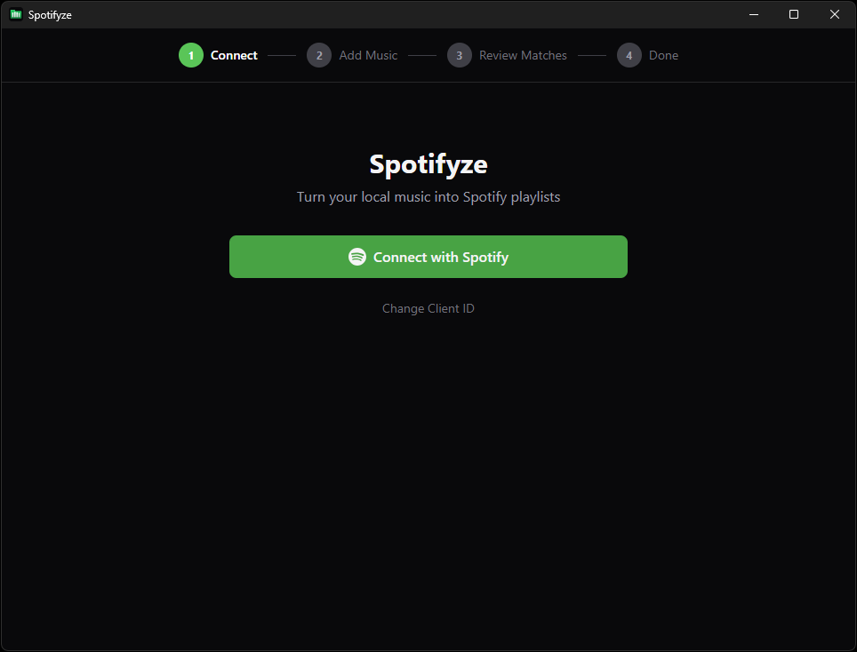
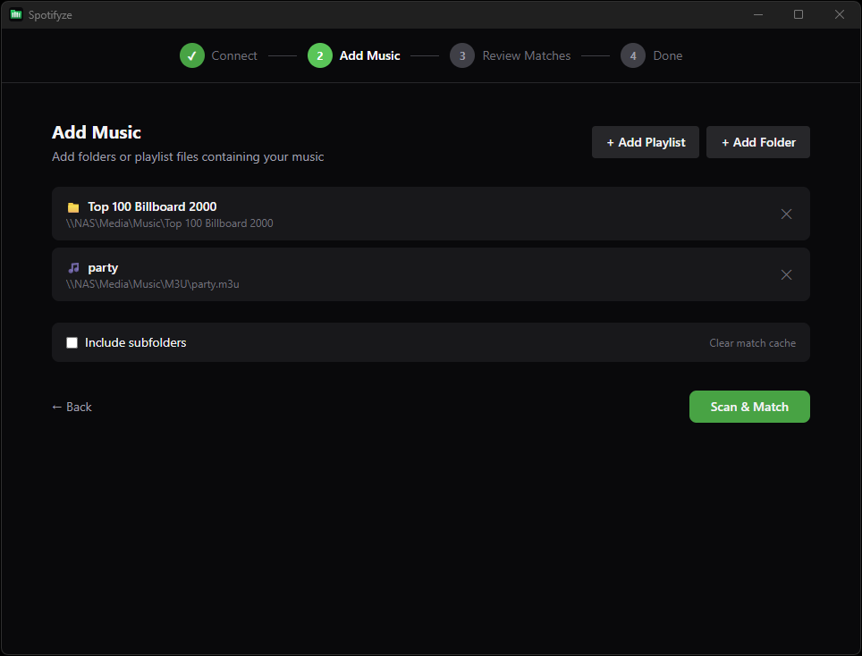
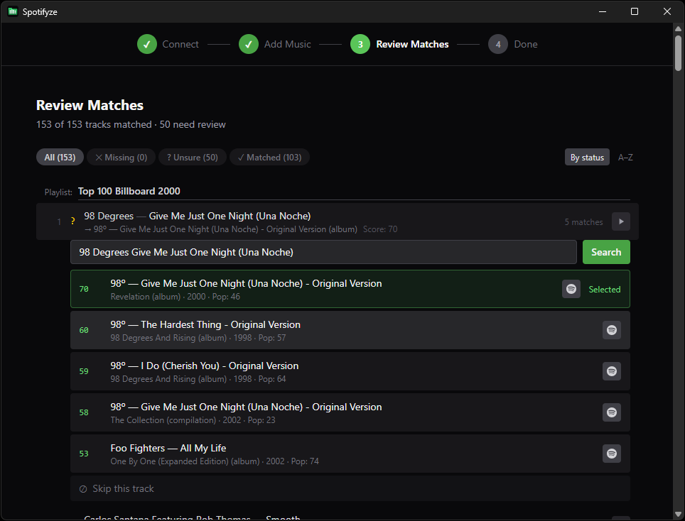

# Spotifyze

[](https://github.com/patrix87/spotifyze/actions/workflows/ci.yml)
[](https://github.com/patrix87/spotifyze/releases/latest)
[](https://github.com/patrix87/spotifyze/issues)
[](https://github.com/patrix87/spotifyze/pulls)
[](LICENSE)

Turn your local music into Spotify playlists.

A desktop app that imports your local music library into Spotify. It reads metadata from audio files and playlist files, fuzzy-matches them against Spotify's catalog (preferring original album releases over compilations and remixes), and creates playlists with the matched tracks.

> **Transparency notice:** This tool was entirely developed using AI (Claude Opus 4.6). I am an experienced developer and I have reviewed all the code, it is thoroughly tested with good unit test coverage across both the frontend and backend. I would not have released it if I wasn't satisfied with its quality. That said, I believe it is important to disclose when AI is used to build tools. Spotifyze is open source and free for personnal use, and it will stay that way, for anyone to use, inspect, or scrutinize.

## Features

- **Drag and drop** - drop folders or `.m3u` playlist files directly into the app
- **Multi-source support** - scan folders and M3U playlists, each becomes its own Spotify playlist
- **Smart matching** - fuzzy scoring prefers original album releases over remixes, compilations, and live versions
- **Review before creating** - see all matches, pick alternatives, preview audio, skip what you don't want
- **Filter & sort** - filter by match status, sort by name or confidence score
- **Audio preview** - listen to Spotify previews or local files before confirming
- **Editable playlist names** - rename playlists before creating them
- **Match caching** - results are saved so re-scanning is instant
- **Cross-platform** - runs on Windows, macOS, and Linux
- **No server needed** - connects directly to Spotify via OAuth (PKCE)

## Screenshots

**Connect** — Enter your Spotify Client ID and log in with one click.



**Add Music** — Drop folders or `.m3u` playlist files. Each source becomes its own Spotify playlist.



**Review Matches** — Browse every match with confidence scores, pick alternatives, preview audio, and skip tracks you don't want before creating the playlist.



**Done** — Your playlist is now on Spotify !

## Download

Grab the latest release for your platform from [GitHub Releases](../../releases).

> **Note:** The installers are not code-signed. On Windows you may see a SmartScreen warning — click "More info" then "Run anyway" to proceed. On macOS, right-click the app and select "Open" to bypass Gatekeeper.

| Platform              | File                  |
|-----------------------|-----------------------|
| Windows               | `.exe` or `.msi`      |
| macOS (Apple Silicon) | `.dmg` (aarch64)      |
| macOS (Intel)         | `.dmg` (x86_64)       |
| Linux                 | `.AppImage` or `.deb` |

## Setup

Before first use, you need a Spotify Client ID (free)

1. Go to [developer.spotify.com/dashboard](https://developer.spotify.com/dashboard)
2. Log in and create a new app (any name, any description)
3. In the app settings, add `http://127.0.0.1:8888/callback` as a **Redirect URI**
4. Copy the **Client ID** from the app dashboard
5. Open the app and paste the Client ID when prompted

> The app runs entirely on your machine - your Client ID is stored locally and never sent anywhere except Spotify's auth servers.

## How It Works

1. **Connect** - enter your Client ID and log in to Spotify
2. **Add Music** - drop or browse for folders and `.m3u` playlist files containing your music
3. **Review Matches** - the app searches Spotify for each track and shows the best matches. Tracks are scored by:
   - Artist similarity (40%)
   - Title similarity (30%)
   - Album similarity (15%)
   - Album type - `album` preferred over `single`/`compilation` (10%)
   - Popularity tiebreaker (5%)
4. **Create** - confirm and the playlist is created on your Spotify account

## Supported Formats

**Audio files:** MP3, FLAC, M4A (AAC/ALAC), OGG Vorbis, WAV - metadata is read using the [lofty](https://github.com/Serial-ATA/lofty-rs) crate.

**Playlist files:** M3U / M3U8 entries are resolved from `#EXTINF` metadata or by reading the referenced audio files.

## Build from Source

Prerequisites: [Node.js 20+](https://nodejs.org/), [Rust](https://rustup.rs/), and the [Tauri v2 prerequisites](https://v2.tauri.app/start/prerequisites/) for your OS.

```bash
# Install dependencies
npm install

# Run in development mode
npm run tauri dev

# Build for production
npm run tauri build
```

## Tech Stack

- **Frontend** - React 19, TypeScript, Tailwind CSS v4, Zustand
- **Backend** - Rust, Tauri v2
- **Audio metadata** - lofty
- **Fuzzy matching** - strsim (Jaro-Winkler)

## Disclaimer

**Spotifyze is not affiliated with, endorsed by, or associated with Spotify AB or any of its subsidiaries.** "Spotify" is a registered trademark of Spotify AB. This is an independent, open-source project that uses the public Spotify Web API.

## License

This project is licensed under the [PolyForm Noncommercial License 1.0.0](LICENSE). You are free to use, modify, and redistribute this software for **non-commercial purposes only**, with attribution. Commercial use requires a separate agreement - contact the author for licensing.
